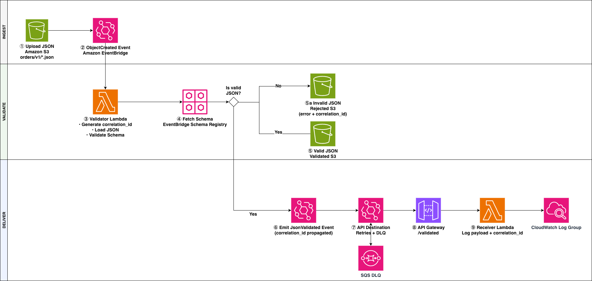

# Event‑Driven JSON Ingestion & Validation on AWS

This repository contains a **serverless, event‑driven architecture** on AWS that:

- Validating JSON files uploaded to Amazon S3 against **versioned JSON Schemas**
- Rejects invalid data early and persistently
- Forwards **only validated data** to a downstream **API Gateway consumer**
- Provides **full end-to-end traceability** using correlation IDs

The architecture is designed to be **cloud-native, decoupled, observable, and enterprise ready**. The design ensures **validation at the boundary, and schema governance**, while remaining simple, observable, and cost‑efficient.

---

## 🧠 Architecture Overview



### High‑level flow

```
S3 (raw JSON)
 └─▶ EventBridge (aws.s3)
      └─▶ Lambda: Schema Validator
           ├─ Invalid → Rejected S3 (+ metrics)
           └─ Valid
                └─ PutEvents (custom event)
                     └─▶ EventBridge Rule
                          └─▶ API Destination
                               └─> API Gateway
                                  └─> Dummy Receiver Lambda
                                        └─> CloudWatch Logs
                               ├─ Retries
                               └─ DLQ (SQS)
```
Correlation flow

```
S3 upload
 └─> Validator Lambda
      ├─ generate correlation_id
      ├─ log with correlation_id
      ├─ include correlation_id in:
      │    • EventBridge event detail
      │    • S3 rejected / validated payload metadata
      └─> EventBridge API Destination
             └─> API Gateway
                  └─> Receiver Lambda logs correlation_id
```

### Key principles

- Event‑driven, not request‑driven
- JSON schema validation at ingestion boundaries
- Strong separation of concerns
- No polling
- Native AWS integrations only
- EventBridge routing happens only on validated events
- Raw S3 events never reach the destination.
- Loose coupling between producers and consumers
- Retry and Dead-Letter-Queue (DLQ) handling
- End-to-end observability via correlation IDs

---

## 🧩 Components

### Amazon S3 (Ingestion)
- Entry point for JSON ingestion
- Publishes object‑level events directly to EventBridge
- Uses suffix convention (`.json`). For further filtering (e.g. a prefix), new rules can be set up

### Amazon EventBridge
- Acts as the central event backbone
- Receives S3 `Object Created` events
- Filters relevant objects using rules
- Routes events to validation Lambda
- Routes custom validated events to downstream consumers
- Provides fan-out, retries, and DLQ support

### EventBridge Schema Registry
- Stores **JSON Schemas for file contents**
- Manages schema versioning automatically
- Validator Lambda always retrieves the **latest schema**
- Used for **data contracts**, not S3 event schemas

---

### Schema Validator Lambda
- Triggered by EventBridge on S3 object creation
- Responsibilities:
  1. Load JSON from S3
  2. Resolve schema based on object key
  3. Validate JSON using `jsonschema`
  4. ❌ If invalid:
     - Write detailed error report in rejected bucket
  5. ✅ If valid:
     - Write JSON to validated bucket
     - Emit a `JsonValidated` custom event to EventBridge

- Runs on **ARM64**
- Uses a Lambda Layer for third‑party dependencies

---

### EventBridge API Destination
- Receives `JsonValidated` events only
- Handles:
  - HTTP invocation
  - retry policy
  - dead-letter queue (SQS)
- Invokes API Gateway using an IAM role

---

### API Gateway (HTTP API)
- Corporate-firewall-safe HTTPS endpoint
- Serves as the downstream API consumer
- Integrates with a dummy Receiver Lambda for testing

NOTE: Aim of the Proof-Of-Concept is to discuss extending to Azure Service Bus integration

---

### Receiver Lambda
- Invoked by API Gateway
- Logs validated payloads to CloudWatch
- Acts as a stand-in for real downstream services

---

## 🔎 Correlation ID & Tracing

### Correlation ID strategy

- A **single correlation ID** is generated per ingested file
- Generated by the **Schema Validator Lambda**
- Propagated through:
  - Validator logs
  - Rejected S3 error reports
  - EventBridge validated events
  - API Gateway payloads
  - Receiver Lambda logs

### Example correlation ID

```
corr-7f8a1f0c-3a0c-4c7b-9d1a-4dfb6ec2b7c1
```
### Example validated event payload

```json
{
  "data": {
    "orderId": "PRD00123",
    "amount": 10
  },
  "metadata": {
    "correlation_id": "corr-7f8a1f0c-3a0c-4c7b-9d1a-4dfb6ec2b7c1",
    "bucket": "json-ingestion-...",
    "key": "orders/v1/test.json",
    "schema": "orders-v1"
  }
}
```

### Tracing end-to-end

In CloudWatch Logs Insights:

```
fields @timestamp, @message
| filter @message like /corr-7f8a1f0c/
| sort @timestamp asc
```
This shows the complete lifecycle of a single ingested file

## 📁 Repository Structure

```terminal
├── README.md
├── architecture.png        # Architecture diagram image
├── S3-EventBridge-Lambda-SchemaRegistry-S3.drawio # Architecture diagram
├── Makefile                # build file to create zip files for Lambdas
├── lambda/                 # Validator Lambda
│   ├── schema              # sample JSON to ingest in S3 injection bucket and sample JSON Schema
│   ├── handler.py          # Lambda handler (function code)
│   └── test_event.json     # Local EventBridge test event
├── receiver/               # API consumer Lambda
│   ├── receiver.py          # Lambda handler (function code)
├── layer/
│   ├── requirements.txt    # Runtime dependencies
│   └── python/             # Built Lambda layer contents
├── lambda.zip              # Function artifact (generated)
├── lambda-layer.zip        # Layer artifact (generated)
└── .terraform/
│   ├── api-gateway.tf      # Amazon API Gateway and API Destination config
│   ├── eventbridge.tf      # Amazon EventBridge config
│   ├── iam.tf              # Amazon IAM Role and Policy config
│   ├── lambda-receiver.tf  # AWS Lambda Receiver config
│   ├── lambda-validator.tf # AWS Lambda Validator config
│   ├── providers.tf        # AWS provider and cost allocation tags that all resources inherit
│   ├── s3.tf               # Amazon S3 bucket config
│   ├── sqs.tf              # Amazon SQS dead-letter-queue (DLQ) config
│   ├── variables.tf        # Terraform variables
```

## 🧪 Local Development & Testing

Local testing uses the **official AWS Lambda Docker image**, providing strong parity with the AWS runtime.

### Build artifacts

```bash
make build
```

This:

- Builds dependencies inside Amazon Linux
- Produces:
  - lambda.zip (validator)
  - receiver.zip (receiver)
  - lambda-layer.zip (dependencies)

### Test validator locally

Run in a terminal:

```bash
make local-validator
```

### Invoke locally

Run in a second terminal:

```bash
curl -X POST \
  http://localhost:9000/2015-03-31/functions/function/invocations \
  -d @lambda/test_event.json
```

#### Expected response

In first terminal:

```json
Event received: {
  "detail": {
    "bucket": {
      "name": "json-ingestion-43aa86fb"
    },
    "object": {
      "key": "orders/v1/order.json"
    }
  }
}
```

In second terminal:
```json
{ "status": "LOCAL_OK" }
```
### Test receiver locally

Run in a terminal:

```bash
make local-receiver
```

### Invoke locally

Run in a second terminal:

```bash
curl -X POST \
  http://localhost:9001/2015-03-31/functions/function/invocations \
  -d '{"test":"validated payload"}'
```

#### Expected response

In first terminal:

```json
{
  "correlation_id": "unknown",
  "message": "validated_event_received",
  "payload": {
    "test": "validated payload"
  }
}
```

In second terminal:

```json
{"statusCode": 200, "body": "{\"status\": \"ok\"}"}%  
```

### End-to-End Testing in AWS

1. Upload a valid JSON file to S3:

```bash
aws s3 cp valid-order.json \
  s3://<INGESTION_BUCKET>/orders/v1/test.json
```

2. Verify:
  - Validator Lambda logs
  - File appears in validated bucket
  - Receiver Lambda log group exists
  - Receiver logs show validated payload
3. Upload an invalid JSON file and confirm:
  - Error report written to rejected bucket
  - No validated event emitted
  - Receiver Lambda NOT invoked

#### Expected result

When invoked via EventBridge → API Gateway, you should see:

```json

{
  "correlation_id": "corr-7f8a1f0c-...",
  "message": "validated_event_received",
  "payload": {
    "data": { ... },
    "metadata": {
      "correlation_id": "corr-7f8a1f0c-...",
      ...
    }
  }
}
```

- Correlation ID preserved end‑to‑end
- API Gateway + EventBridge flow verified

### Deployment

Infrastructure is provisioned using Terraform.

Key configuration points:

- S3 bucket has eventbridge = true
- EventBridge rule filters .json objects
- Validator Lambda configuration:
  - runtime: python3.12
  - architecture: arm64
  - handler: handler.lambda_handler
  - dependency layer attached
- Receiver Lambda configuration
  - runtime: python3.12
  - architecture: arm64
  - handler: receiver.lambda_handler

#### Deploy with:

```bash
terraform plan -out dev.plan
terraform apply "dev.plan"
```

### JSON Schema Example

Example schema stored in EventBridge Schema Registry (orders-v1):

```json
 {
  "$schema": "http://json-schema.org/draft-07/schema#",
  "title": "Order",
  "type": "object",
  "additionalProperties": false,
  "required": ["orderId", "amount"],
  "properties": {
    "orderId": {
      "type": "string",
      "minLength": 1
    },
    "amount": {
      "type": "number",
      "minimum": 0
    }
  }
}
```

Schemas are strict by default, centrally versioned, and retrieved dynamically by the Lambda.

### Key Design Decisions

#### Why EventBridge instead of SNS/SQS/Lambda triggers?

- Rich filtering
- Fan‑out without refactoring
- Built‑in retries and replay
- Cleaner decoupling

#### Why Schema Registry?

- Validation is a first-class concern
- Central governance of contracts
- Version history and evolution
- No redeploy needed for schema changes

#### Why Lambda Layer?

- Native dependencies (rpds)
- Smaller function ZIP
- Faster cold starts
- Clean CI/CD separation

#### Why ARM64?

- Matches Apple Silicon local builds
- Lower cost
- Better performance
- Avoids native extension mismatch

### ⚠️ Common Pitfalls (Already Addressed)

- S3 → EventBridge propagation delays
- Terraform provider syntax for EventBridge
- Lambda ZIP structure (handler at root)
- Native dependency architecture mismatch
- SchemaVersion misuse (latest is invalid)
- Local vs AWS credential behavior

### ✅ Production Readiness Checklist

- Event‑driven ingestion
- Boundary validation
- Schema governance
- Decoupled components
- Reproducible builds
- Local / AWS parity
- Native dependency correctness
- Observability designed-in, not bolted-on